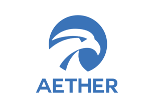

This is the working repository for ATH Coin 4.1.1, our fork of bitcoin-core 0.13.

For more information please visit the website:

https://aethercoin.org/project-roadmap/

## Coin Specifications

| Specification | Value |
|:-----------|:-----------|
| Block Spacing | `30 seconds` |
| Stake Minimum Age | `2 hours` |
| Stake Maximum Age | `24 hours` |
| Stake Reward | `5% per annum` |
| Port | `44445` |
| RPC Port | `44447` |

## Social Channels

| Site | link |
|:-----------|:-----------|
| Medium | https://medium.com/ATH-coin |
| Twitter | https://twitter.com/aethercoin |
| Discord | https://discord.gg/y4Vu9jw |
| Telegram | https://t.me/aethercoin |
| Reddit | http://www.reddit.com/r/aethercoin |
| Facebook | https://www.facebook.com/ATHCoin |
| Instagram | https://www.instagram.com/ATH.coin.official/ |
| Bitcointalk | https://bitcointalk.org/index.php?topic=679791 |

## Community Resources

| Site | link |
|:-----------|:-----------|
| Trello Board | [https://trello.com/ATH-community](https://trello.com/invite/b/rPdvVVL4/ba5c40a885fd3c02cda2a8b406ff7124/ATH-community) |
| ATH Community | http://ATHcommunity.net |

License
---------------------
Distributed under the [MIT software license](http://www.opensource.org/licenses/mit-license.php).
